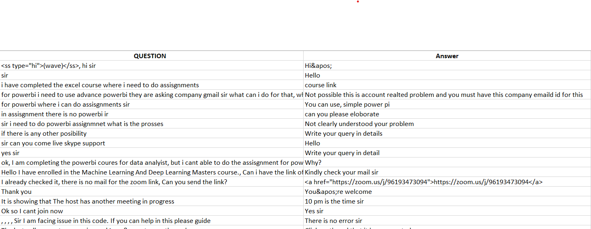

# KIRA 
##### A smart bot trained using Ineuron twitter dataset.

 
 
 
 
 

#### Preprocessing the data :
We process the given data by extracting the text from json file , and pairing the questions with answers. In the end we got more 4 lakh question answer pair sets. We used this data for our prediction of answer to repetitive questions.

#### Processing the data :

 We have used NLTK library to process our data .
 
 - We dropped duplicated questions set. 
 - We dropped null questions set.
 - We removed stopwords and lemmatized the question text.
 - We tokenize the text.
 - By using above steps we transformed the data.
 

#### User input :
 - User will enter a question 
 - The question will be transformed by using above steps
 - The tokenized question will be compared with saved data and mathcing answer will be printed out. 
 - The question which is similar to asked question will be printed out